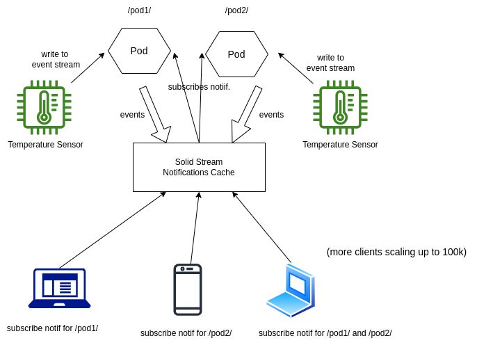

## Solid Stream Notifications Aggregator

The Solid Stream Notifications Aggregator is a service which works on top of one or more Solid Pods to provide an immediate aggregator for the clients to consume the streaming data stored in the Solid Pods. The Stream Registry maintains state with the Solid Pods and provides an interface for the clients to interact with the registry instead of the Solid Pods directly. As the experiment done by the maintainers of [CSS](https://github.com/CommunitySolidServer/CommunitySolidServer) demonstrated [here](https://github.com/CommunitySolidServer/CommunitySolidServer/issues/1843#issuecomment-1948600398), the different configurations of the Solid Server can handle around 1k - 2k concurrent GET requests. Some configurations however, such as using the distributed locking approach with the Redis server, it can handle around 15k requests. However, only when the lock expiration time is set to a maximum of 5 minutes (which is not feasible). In cases where there are 3k concurrent GET requests, the response time for the requests is too high. In the expriment done, it took around 17 seconds to respond to 3k concurrent GET requests. This is not feasible for a real-time application as the 2999th client will have to wait for 17 seconds to get the response. The Solid Stream Notifications Aggregator is designed to solve this problem by providing an aggregation for the clients to consume the streaming data stored in the Solid Pods. 

An initial architecutre of the Solid Stream Notifications Aggregator is shown below:



- In the current architecture, we only work with the webhook notification of the solid pods and Aggregator them. We don't support websocket notifications yet as they are not very scalabble.(but would appreciate a PR for that in case you wish to implement it).

## Installation

## Usage

To run the server, you can run the server using the following command:
```bash
npm run start
```
The interface for the service is a Websocket server with which you can interact. The server accepts a subscribe message as shown below:

```json
{
    "subscribe": "http://localhost:3000/aggregation_pod/aggregation/"
}
```
which can be sent to the server to subscribe to the latest events from the particular LDES stream. The server will then send the events to the client as and when they are received. A sample script for the client is shown below:
```ts
import { WebSocket } from "ws";

async function main() {
    const websocket = new WebSocket('ws://localhost:8085//', 'solid-stream-notifications-aggregator', {
        perMessageDeflate: false
    });
    websocket.once('open', () => {
        console.log('Connection to the WebSocket server was successful.');
        let message_object = {
            subscribe: `http://localhost:3000/aggregation_pod/aggregation/`
        };
        websocket.send(JSON.stringify(message_object));
    });

    websocket.on('message', (data) => {
        console.log(data.toString());
    });
}

main()

```
The client will receive message such as,
```json
{
    "stream": "stream_url",
    "published_time": "time_of_notification",
    "event": "the_notification_event"
}
```

## License
This code is copyrighted by [Ghent University - imec](https://www.ugent.be/ea/idlab/en) and released under the [MIT License](./LICENSE). 

## Contact

For any questions, please contact [Kush](mailto:kushagrasingh.bisen@ugent.be) or create an issue in the repository [here](https://github.com/argahsuknesib/solid-stream-registry/issues).